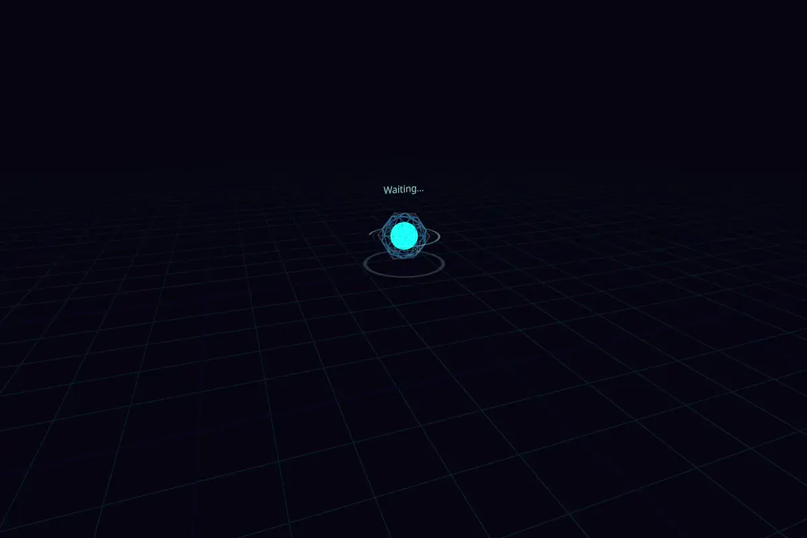

# Mikaboshi

Mikaboshiは、ネットワークトラフィックをブラウザ上の3D空間でリアルタイムに可視化するアプリケーションです。
Rust製の高性能なエージェントとサーバー、そしてReact + Three.jsによるモダンなフロントエンドで構成されています。


## 構成

- **Mikaboshi-Server**:
    - エージェントからのデータを受け取り、トラフィックを3D可視化するWebフロントエンドです。    
    - RustとReactで実装されています。
- **Mikaboshi-Agent**:
    - libpcapを使用してネットワークトラフィックをキャプチャします。
    - gRPCを使用してキャプチャしたデータをサーバーに送信します。
    - Rustで実装されており、LinuxおよびWindowsで動作します。
        - Windows環境でエージェントを実行する場合、[Npcap](https://npcap.com/)のインストールが必要です。

## 実行方法

### 1. Mikaboshi-Server

サーバーを起動すると、WebサーバーとgRPCサーバーが立ち上がります。

```bash
# 直接起動
./mikaboshi-server

# Docker起動
# Docker Compose利用の場合は、docker-compose/server/compose.ymlを参考にしてください
docker run -d --name mikaboshi-server -p 8080:8080 -p 50051:50051 arianpg/mikaboshi-server:latest
```

**オプション:**

| 引数オプション | Docker環境変数 | 説明 | デフォルト値 |
| --- | --- | --- | --- |
| `--http-port <u16>` | `HTTP_PORT` | Webサーバーのポート | 8080 |
| `--grpc-port <u16>` | `GRPC_PORT` | gRPCサーバーのポート | 50051 |
| `--peer-timeout <u64>` | `PEER_TIMEOUT` | 通信がないPeerを切断とみなすまでの秒数 | 30 |
| `--channel-capacity <u64>` | `CHANNEL_CAPACITY` | トラフィックチャネルの容量 | 4096 |
| `--geoip-path <string>` | `GEOIP_PATH` | ローカルMMDBファイルのパス。設定されている場合、ipapiの代わりに使用されます。 | なし |
| `--basic-auth-user <string>` | `BASIC_AUTH_USER` | Basic Authのユーザー名 | なし |
| `--basic-auth-password <string>` | `BASIC_AUTH_PASSWORD` | Basic Authのパスワード | なし |
| `--traffic-max-threshold <f64>` | `TRAFFIC_MAX_THRESHOLD` | トラフィック表示の最大値(Byte) | 1000000.0 (1MB) |

### 2. Mikaboshi-Agent

エージェントは管理者権限(root)で実行する必要があります。

```bash
# 直接起動
sudo ./mikaboshi-agent --server localhost:50051 --device eth0

# Docker起動
# Docker Compose利用の場合は、docker-compose/agent/compose.ymlを参考にしてください
docker run -d --name mikaboshi-agent arianpg/mikaboshi-agent:latest -e MIKABOSHI_AGENT_SERVER=serverip:50051
```

**オプション:**

| 引数オプション | Docker環境変数 | 説明 | デフォルト値 |
| --- | --- | --- | --- |
| `--server <string>` | `MIKABOSHI_AGENT_SERVER` | 接続先サーバーのアドレス | "localhost:50051" |
| `--device <string>` | `MIKABOSHI_AGENT_DEVICE` | キャプチャ対象のデバイス名 | "any" |
| `--snapshot <u32>` | `MIKABOSHI_AGENT_SNAPSHOT` | パケットキャプチャするデータの最大長 | 1024 |
| `--promiscuous` | `MIKABOSHI_AGENT_PROMISCUOUS` | プロミスキャスモードを有効にします | false |
| `--ipv6` | `MIKABOSHI_AGENT_IPV6` | IPv6トラフィックもキャプチャ対象にします (デフォルトはIPv4のみ) | false |
| `--mock` | `MIKABOSHI_AGENT_MOCK` | 実際のトラフィックの代わりにモックデータを生成して送信します | false |
| `--list_devices` | - | 利用可能なデバイス一覧を表示して終了します<br/>Windows環境でのネットワークインターフェース確認用 | false |

### 3. ブラウザでアクセス

ブラウザで `http://localhost:8080` (または設定したポート) にアクセスしてください。

## 機能

- **リアルタイム可視化**: エージェント(球体)と通信相手(ディスク)のトラフィックを光るラインで表示します。
- **データ量表現**: トラフィックのサイズに応じてラインの色が変化します。
- **詳細情報**: PeerのIPアドレスや国情報を表示します。
    - デフォルトでは[ipapi](https://ipapi.co)を使用しますが、ローカルのMMDBファイル(要別途入手)を使用することも可能です。
    - [DB-IP IP to City Lite database](https://db-ip.com/db/download/ip-to-city-lite) のMMDBファイルで動作確認しています

## ビルド

### 前提条件

ビルドには以下のツールが必要です：

- Docker
- Make

### ビルド手順

以下のコマンドで各コンポーネントをビルドできます。成果物は `build` ディレクトリに出力されます。

```bash
# 全てをビルド
make build-all

# エージェントのみビルド (Linux用)
make build-agent

# エージェントのみビルド (Windows用)
make build-agent-windows

# サーバーとWebフロントエンドをビルド
make build-server

# サーバーのDockerイメージをビルド
make build-docker-server
```

## AIによる開発支援

本プロジェクトのコーディングには、Gemini 3 Proを活用しています。

## ライセンス

MIT License

### Third Party Licenses

This software uses the following third-party software:

*   **libpcap**
    *   License: BSD 3-Clause License
    *   Copyright (c) The Tcpdump Group
*   **protobufjs**
    *   License: BSD 3-Clause License
    *   Copyright (c) 2016, Daniel Wirtz
*   **google-protobuf**
    *   License: BSD 3-Clause License
    *   Copyright (c) Google Inc.
